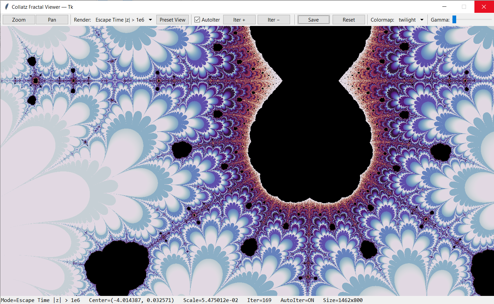

# Collatz Fractal Viewer

Interactive explorer for the complex Collatz fractal built with Python and Tkinter.

The application visualizes the behavior of the complex-valued Collatz function:

C(z) = 1/4 * (2 + 7z - (2 + 5z) cos(πz))

This function is a smooth extension of the famous Collatz (3n + 1) problem into the complex plane. By repeatedly iterating the function and analyzing the resulting orbit, fascinating fractal structures emerge.

---

## Application Preview




---

## Features

### Interactive Navigation

* Mouse wheel zoom
* Rectangle zoom
* Click-and-drag panning
* Reset view
* Deep exploration of fractal structures

### Multiple Rendering Modes

* Escape Time
* Small Orbit Detection (|zₙ| ≤ 1)
* Large Orbit Detection (|zₙ| ≥ 100)
* Point 5+0i Correspondence Modes
* Point 10+0i Correspondence Modes

### Visualization Tools

* Multiple color palettes
* Gamma correction
* Automatic iteration scaling
* High-resolution PNG export
* Smooth coloring

### Performance

* Vectorized NumPy computations
* Responsive Tkinter interface
* Large image rendering support

---

## Installation

Create the environment and install dependencies:

```bash
conda create -n collatz-fractal-viewer python=3.11 -y
conda activate collatz-fractal-viewer
pip install -r requirements.txt
```

---

## Run

```bash
python collatz_fractal_tk.py
```

---

## Controls

| Action                | Control          |
| --------------------- | ---------------- |
| Zoom In               | Mouse Wheel Up   |
| Zoom Out              | Mouse Wheel Down |
| Rectangle Zoom        | Left Mouse Drag  |
| Pan                   | Pan Mode + Drag  |
| Reset                 | Right Click      |
| Save Image            | Save Button      |
| Change Palette        | Dropdown         |
| Change Rendering Mode | Dropdown         |

---

## Mathematical Background

The classical Collatz function is defined as:

* n/2 if n is even
* 3n + 1 if n is odd

This project uses a smooth complex extension:

C(z) = 1/4 * (2 + 7z - (2 + 5z) cos(πz))

Iterating this function over complex numbers produces the Collatz fractal, whose structure is closely related to the famous Collatz conjecture.

---

## License

Apache License 2.0